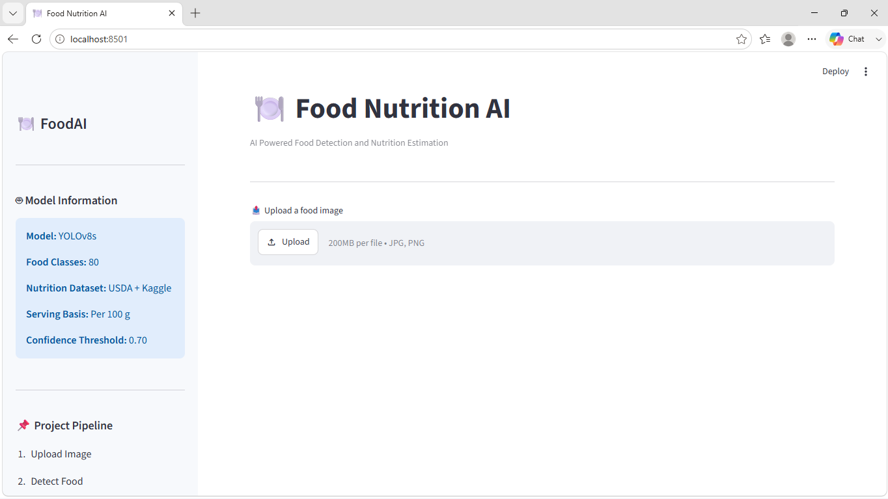
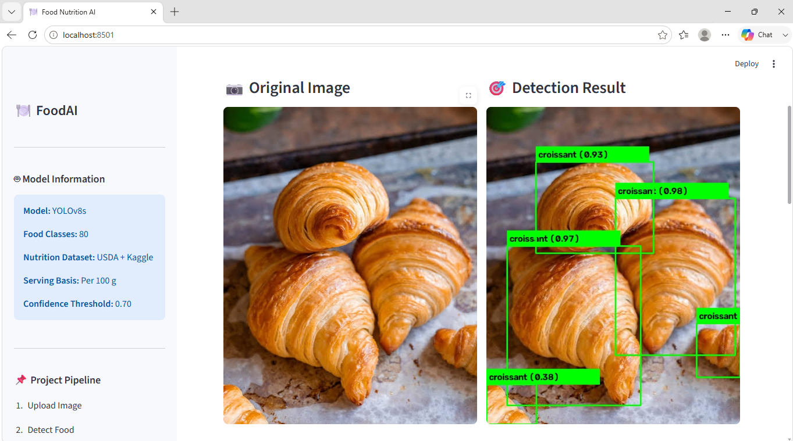
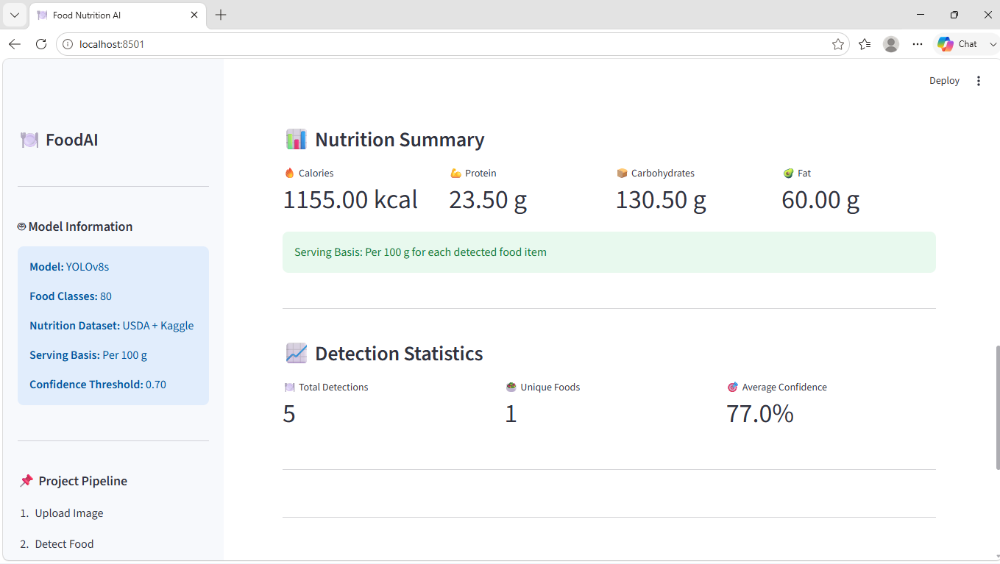

# 🍽️ Food Nutrition AI

> **AI-Powered Food Detection and Nutrition Estimation using YOLOv8, Computer Vision, and Streamlit**

---

## 📖 Overview

Food Nutrition AI is an end-to-end Computer Vision application that detects food items from an image and provides nutritional information for each detected item. The project combines **YOLOv8 object detection**, **fuzzy string matching**, and a **nutrition database** to estimate calories, protein, carbohydrates, and fat.

The application provides an intuitive **Streamlit web interface** where users can upload a food image, visualize detected food items with bounding boxes, and view nutritional information in real time.

---

## ✨ Features

- 🍕 Detect 80 different food classes using YOLOv8
- 📷 Upload JPG and PNG images
- 🎯 Draw bounding boxes around detected food items
- 🍎 Nutrition lookup using a food nutrition database
- 🔍 Intelligent fuzzy matching using RapidFuzz
- 📊 Nutrition summary dashboard
- 📋 Multiple food detection with food counts
- 🖥️ Interactive Streamlit web application
- ⚙️ Configurable project structure
- 📦 Modular Python architecture

---

## 🛠️ Technologies Used

| Technology | Purpose |
|------------|---------|
| Python | Programming Language |
| YOLOv8 | Food Detection |
| Ultralytics | Object Detection Framework |
| OpenCV | Image Processing |
| Streamlit | Web Application |
| Pandas | Data Processing |
| Pillow | Image Handling |
| RapidFuzz | Fuzzy Food Matching |
| Kaggle | Model Training |
| Roboflow | Dataset Preparation |

---
## 📂 Project Structure

```text
Food-Nutrition-AI/
│
├── app.py                     # Streamlit Application
├── config.py                  # Project Configuration
├── requirements.txt           # Project Dependencies
├── README.md
│
├── datasets/
│   └── nutrition_dataset.csv
│
├── inference/
│   ├── detector.py
│   └── inference.py
│
├── models/
│   └── best.pt                # Trained YOLOv8 Model
│
├── nutrition/
│   ├── nutrition_lookup.py
│   └── nutrition.csv
│
├── outputs/
│   └── detected_food.jpg
│
├── sample_images/
│
├── screenshots/
│
├── training/
│
└── utils/
    ├── image_utils.py
    └── visualization.py
```

---

# 🏗️ System Architecture

```text
                User Uploads Image
                        │
                        ▼
               Streamlit Web Interface
                        │
                        ▼
                Image Preprocessing
                        │
                        ▼
              YOLOv8 Food Detection
                        │
        ┌───────────────┴───────────────┐
        ▼                               ▼
 Food Name Detection             Bounding Boxes
        │                               │
        ▼                               ▼
 Nutrition Lookup               Visualization
        │
        ▼
 Nutrition Summary
        │
        ▼
 Display Results in Streamlit
```

---

# ⚙️ Project Workflow

```text
Food Image
     │
     ▼
YOLOv8 Detection
     │
     ▼
Detected Food Classes
     │
     ▼
Nutrition Lookup
     │
     ▼
Calories • Protein • Carbohydrates • Fat
     │
     ▼
Nutrition Summary Dashboard
```

---

## Dataset Used

The model was fine-tuned using a custom balanced food detection dataset created by merging multiple Roboflow Universe datasets.

The datasets include:

- Fruits Dataset (9 classes)
- Food Detection Dataset (63 classes)
- Fast Food Finder Dataset (10 classes)
- Indian Food Detection Dataset (23 classes)
- Indian Food Dataset (7 classes)

The datasets were converted into YOLO format, merged, cleaned, duplicate classes were unified, and class imbalance was reduced before training.

Final Dataset:

- 80 Food Classes
- Approximately 22,000+ Images
- YOLO Object Detection Format

# 📊 Key Features

- ✅ Detects multiple food items in a single image.
- ✅ Supports **80 food categories**.
- ✅ Displays bounding boxes with confidence scores.
- ✅ Performs fuzzy matching for nutrition lookup.
- ✅ Generates nutrition summary automatically.
- ✅ Supports JPG and PNG image formats.
- ✅ Interactive Streamlit dashboard.
- ✅ Modular and scalable project architecture.

---
## 🚀 Installation

### 1️⃣ Clone the Repository

```bash
git clone https://github.com/AnandAnkam-1595/Food_Nutrition_AI.git
```

### 2️⃣ Navigate to the Project Folder

```bash
cd Food_Nutrition_AI
```

### 3️⃣ Create a Virtual Environment

**Windows**

```bash
python -m venv venv
venv\Scripts\activate
```

**Linux / macOS**

```bash
python3 -m venv venv
source venv/bin/activate
```

### 4️⃣ Install Dependencies

```bash
pip install -r requirements.txt
```

---

# ▶️ Run the Application

```bash
streamlit run app.py
```

The application will automatically open in your browser.

---

# 📸 Application Screenshots


### Home Page

```

```

### Food Detection

```

```

### Nutrition Dashboard

```

```


---

## Fine-Tuning Methodology

The project uses YOLOv8s pretrained weights as the base model.

Fine-tuning Process:

- Started with pretrained YOLOv8s weights.
- Merged five Roboflow food datasets.
- Unified duplicate food categories.
- Balanced class distribution.
- Trained using Ultralytics YOLOv8.
- Image Size: 640×640
- Epochs: 50
- Optimizer: Default YOLOv8 optimizer
- Confidence Threshold: 0.70

# 📈 Model Performance

The YOLOv8 model is fine-tuned on a custom food dataset containing **80 food classes**.

Training Details:

- Model: YOLOv8 Small
- Image Size: 640 × 640
- Epochs: 50
- Optimizer: Auto
- Framework: Ultralytics
# 📈 Model Performance

The custom YOLOv8s model was trained on a balanced dataset containing **80 food classes**.

| Metric | Value |
|--------|-------:|
| Model | YOLOv8s |
| Image Size | 640 × 640 |
| Epochs | 50 |
| Number of Classes | 80 |
| mAP@50 | **0.593** |
| mAP@50-95 | **0.447** |


---

# 🎯 Sample Output

After uploading an image, the application provides:

- ✅ Detected food items
- ✅ Bounding boxes
- ✅ Confidence scores
- ✅ Food count
- ✅ Nutrition lookup
- ✅ Nutrition summary dashboard

---
# Assumptions

- Nutritional values are estimated **per 100 g** for each detected food item.
- The detected food class is matched to the closest corresponding entry in the nutrition dataset using fuzzy string matching.
- Each detected bounding box is treated as a single food item for nutritional estimation.
- The application assumes that the uploaded image contains clearly visible food items.
- The custom YOLOv8s model has been trained on 80 food categories, so foods outside these classes may not be recognized.
- Nutrition estimates are intended for informational purposes and should not be considered medical or dietary advice.

---

# Limitations

- The application does not estimate the actual serving size or weight of food; all nutritional values are based on a standard **100 g serving**.
- Foods that are visually similar (e.g., different rice dishes or similar desserts) may occasionally be misclassified.
- Detection accuracy depends on image quality, lighting conditions, camera angle, and occlusion.
- Food items that are not included in the training dataset may not be detected or may be classified as the closest known class.
- The nutrition database provides approximate nutritional values and may differ from actual recipes or branded food products.
- The current implementation analyzes static images only and does not support real-time video or webcam-based detection.


# 🔮 Future Improvements

- 🍽️ Portion Size Estimation
- ⚖️ Weight Estimation using Computer Vision
- 🔥 Actual Calorie Estimation
- 📄 PDF Nutrition Report
- 📱 Mobile Application
- ☁️ Cloud Deployment
- 🥗 Meal Recommendation System
- ❤️ Personalized Diet Suggestions
- 📊 Nutrition History Dashboard

---

# 👨‍💻 Author

**Anand Yesu Kumar**

Mechanical Engineering Graduate | Data Science & AI Enthusiast

### Skills

- Python
- Machine Learning
- Computer Vision
- YOLOv8
- Streamlit
- SQL
- Power BI

---

# 📄 License

This project is intended for educational and portfolio purposes.

---

# 🙏 Acknowledgements

- Ultralytics (YOLOv8)
- Roboflow
- Kaggle
- USDA Food Nutrition Database
- Streamlit
- OpenCV
- RapidFuzz
